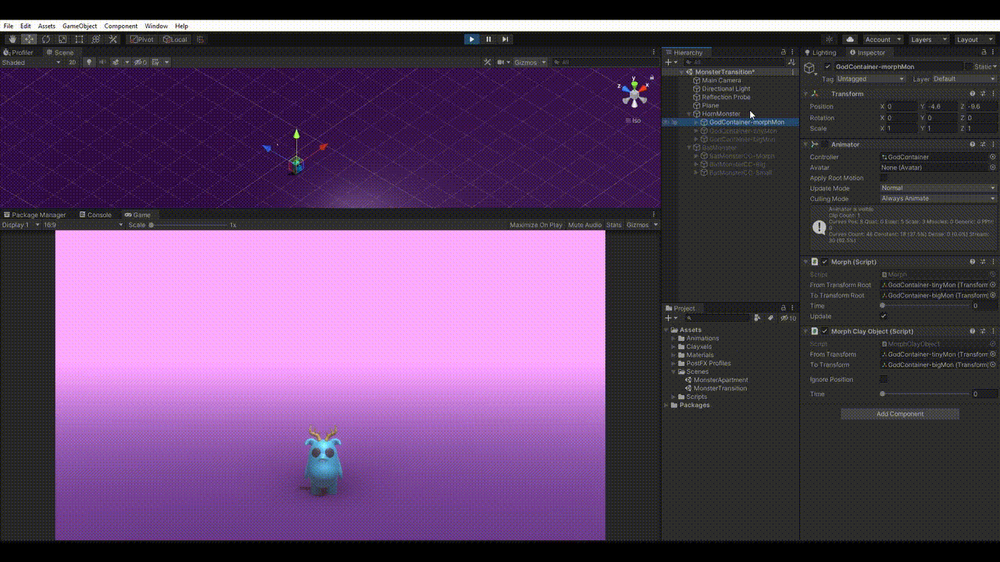

# Monsters w. Clayxels

Assets from our SA Game Jam game, [Monster Sitter](https://riker.itch.io/monster-sitter). We used this jam to see how much we could do with Clayxels. Every 3D asset was created in Clayxels apart from the walls of the apartment.

[Clayxels](https://assetstore.unity.com/packages/templates/systems/clayxels-165312) is **not** inculded in this repo. You can get it on the Unity AssetStore.

We also made these monster transitions that are part of this repo. Scripts included. 

